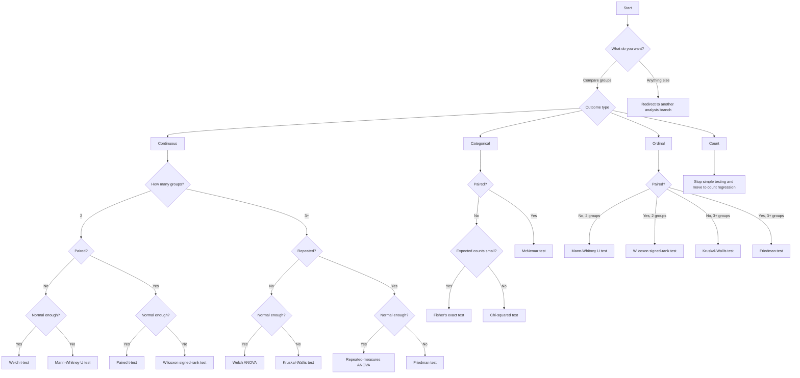

Use this flow for the main scope of version 1.0.0: group comparison.

## Practical rule

- If you only want a standard group comparison, stay on this page.
- If you need adjustment, survival analysis, agreement, or equivalence, `statsguider` should stop and redirect you.
