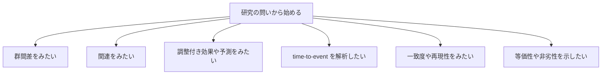
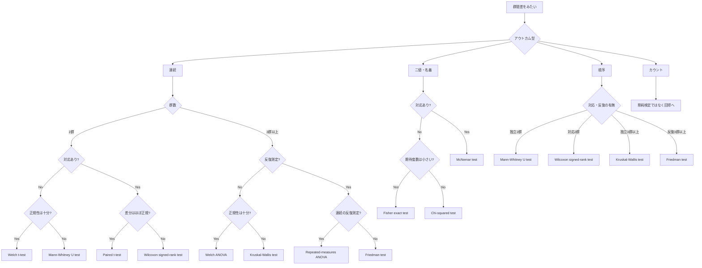

最初に考えるのは研究の問いです。



version 1.0.0 で主に対応するのは群間差の分岐です。

## 群間差の中での基本分岐



## 実務上のルール

- 群間差だけを見たいなら、この分岐に従って `select_test()` を使います。
- 共変量調整、生存時間、一致度、等価性・非劣性は単純検定ではなく別の解析分岐に進みます。
- `statsguider` は不適切な分岐では無理に実行せず、止めて案内します。

## もっともシンプルな例

```r
select_test(
  data = dat,
  outcome = "biomarker",
  group = "group",
  outcome_type = "continuous",
  paired = "no",
  repeated = "no",
  run = "recommend",
  language = "ja"
)
```
